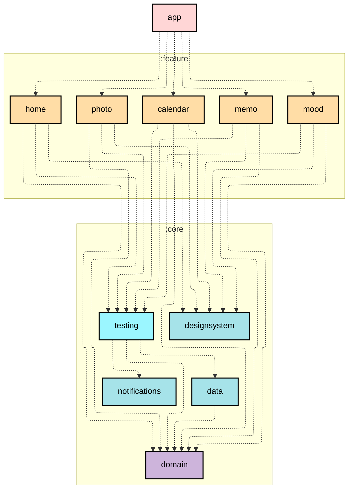

# LifeLog Android App

LifeLog는 Kotlin과 Compose를 기반으로 구현된 안드로이드 앱입니다. 
Clean Architecture와 MVVM 패턴을 따르며, 모든 핵심 모듈이 단위 테스트와 통합 테스트로 검증되어, 안정적이고 신뢰할 수 있는 구조를 제공합니다. 
소중한 메모를 남기고, 다양한 일기를 기록하며 나만의 비밀 기록 애플리케이션으로 활용할 수 있습니다.

## Module dependency graph

## Modules

- **:app** - 모든 모듈에 접근할 수 있는 최상위 모듈 (여기서는 feature의 내비게이션 담당 및 알림 모듈 접근)
- **:core:data** - 데이터 레이어 모듈, domain 모듈에만 접근 가능한 모듈
- **:core:domain** - 레이어간 독립을 지원하는 모듈, 다른 모듈에 접근 할 수 없는 Kotlin 모듈
- **:core:designsystem** - 컴포넌트와 모든 UI 관련(Icons, Theme, Util)을 담당하는 모듈
- **:core:testing** - feature 모듈용 테스트 헬퍼(TestRepository, Rule, Runner 등) 제공하는 모듈
- **:core:notifications** - 앱의 알림을 담당하는 모듈
- **:feature** - 기능 단위로 나눠진 모듈, domain, designsystem, testing에 접근 하는 모듈

## Testing

LifeLog App은 모든 레이어에 대한 테스트를 수행하며, Mock 라이브러리를 사용하지 않고 Hilt Test Api와 수동 주입을 활용합니다.

- **모든 계층**에 대한 테스트 수행:
    - :core:data -> DatabaseTest(Room, Dao 검증)
    - :core:data -> RepositoryTest(TestDao를 이용한 Repository 단위 테스트를 통해 검증)
    - :core:data -> MapperTest(변환 로직 검증)
    - :feature -> 모든 feature 모듈의 각 ViewModel 테스트 완료
        - ViewModel이 의존하는 UseCase 역시 함께 검증됨
        - 따라서 domain 모듈은 따로 테스트를 진행하지 않음
- `Given | When | Then` 방식으로 작성
- 비동기 처리 코드는 TestDispatcher 활용하여 검증
- 가능한 모든 단위 테스트와 통합 테스트를 진행
- State 변화와 데이터 흐름이 의도대로 동작하는지 검증
- 실제 인터페이스를 구현한 간단하지만 의도대로 동작하는 테스트용 Repository, Dao 등을 사용

## Tech Stack

| **분류**            | **내용**                                      |
|-------------------|---------------------------------------------|
| **Language**      | Kotlin                                      |
| **Jetpack**       | Compose, Navigation, ViewModel, WorkManager |
| **Architecture**  | Clean Architecture, MVVM                    |
| **Asynchronous**  | Coroutine, Flow(cold, hot)                  |
| **Database**      | Room                                        |
| **Image Loading** | Coil                                        |
| **DI**            | Hilt                                        |

## Previews

 

