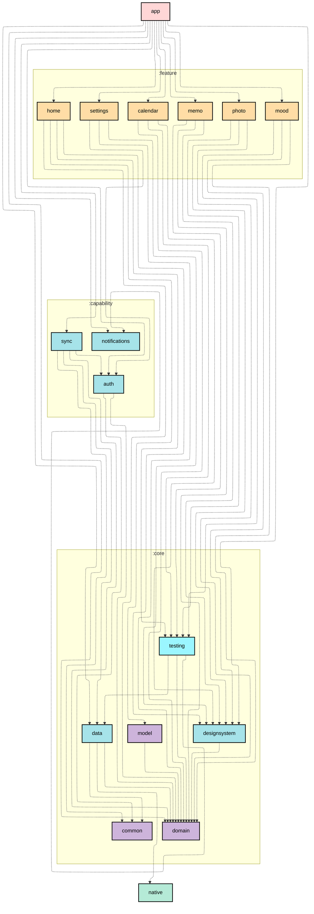

# LifeLog Android App

[](https://github.com/M1n9yu23/LifeLog-Compose-Clean-Architecture/actions/workflows/Build.yml)

하루의 메모, 감정, 사진, 일정을 한 곳에서 기록하는 **Android 일상 기록 앱**입니다.  
캘린더로 날짜별 기록을 한눈에 보고, 감정 변화를 추적하며, 사진 일기와 텍스트 메모를 자유롭게 남길 수 있습니다.

- **인증 및 동기화** — Google 계정으로 로그인하고 Firebase Firestore를 통해 기기 간 데이터를 자동으로 동기화합니다. 이미지 파일 동기화는 Firebase Storage 유료 정책으로 인해 제외했습니다.
- **테스트** — 모든 레이어 모듈은 단위 테스트와 통합 테스트로 검증 됐습니다.
- **빌드 시스템** — Gradle Convention Plugin으로 모든 모듈의 빌드 설정을 관리합니다.
- **Native FTS** — 한국어 검색을 위해 자체 개발한 오픈소스 라이브러리 **[hanfts](https://github.com/M1n9yu23/hanfts)**를 사용합니다.

## Module dependency graph


```mermaid
---
config:
  layout: elk
  elk:
    nodePlacementStrategy: SIMPLE
---
graph TB
subgraph :core
direction TB
:core:data[data]:::android-core
:core:designsystem[designsystem]:::android-core
:core:domain[domain]:::kotlin-library
:core:common[common]:::kotlin-library
:core:model[model]:::kotlin-library
:core:testing[testing]:::android-test
end
subgraph :capability
direction TB
:auth[auth]:::android-core
:sync[sync]:::android-core
:notifications[notifications]:::android-core
end
subgraph :feature
direction TB
:feature:home[home]:::android-feature
:feature:calendar[calendar]:::android-feature
:feature:memo[memo]:::android-feature
:feature:mood[mood]:::android-feature
:feature:photo[photo]:::android-feature
:feature:settings[settings]:::android-feature
end
:app[app]:::android-app
:native[native]:::native-lib

:app -.-> :feature:home
:app -.-> :feature:calendar
:app -.-> :feature:memo
:app -.-> :feature:mood
:app -.-> :feature:photo
:app -.-> :feature:settings
:app -.-> :core:data
:app -.-> :core:domain
:app -.-> :core:designsystem
:app -.-> :notifications
:app -.-> :auth
:app -.-> :sync
:core:data -.-> :core:domain
:core:data -.-> :core:common
:core:data -.-> :native
:auth -.-> :core:common
:auth -.-> :core:domain
:sync -.-> :core:common
:sync -.-> :core:domain
:sync -.-> :core:data
:sync -.-> :auth
:core:model -.-> :core:domain
:core:designsystem -.-> :core:domain
:core:testing -.-> :core:domain
:core:testing -.-> :core:data
:core:testing -.-> :notifications
:feature:home -.-> :core:designsystem
:feature:home -.-> :core:domain
:feature:home -.-> :core:model
:feature:home -.-> :core:testing
:feature:calendar -.-> :core:designsystem
:feature:calendar -.-> :core:domain
:feature:calendar -.-> :core:testing
:feature:memo -.-> :core:designsystem
:feature:memo -.-> :core:domain
:feature:memo -.-> :core:testing
:feature:mood -.-> :core:designsystem
:feature:mood -.-> :core:domain
:feature:mood -.-> :core:testing
:feature:photo -.-> :core:designsystem
:feature:photo -.-> :core:domain
:feature:photo -.-> :core:testing
:feature:settings -.-> :core:designsystem
:feature:settings -.-> :core:domain
:feature:settings -.-> :auth

:core:domain ~~~ :native

classDef android-app fill:#FFD6D6,stroke:#000,stroke-width:2px,color:#000;
classDef android-feature fill:#FFDDA6,stroke:#000,stroke-width:2px,color:#000;
classDef android-core fill:#A6E3E9,stroke:#000,stroke-width:2px,color:#000;
classDef kotlin-library fill:#CDB4DB,stroke:#000,stroke-width:2px,color:#000;
classDef android-test fill:#9BF6FF,stroke:#000,stroke-width:2px,color:#000;
classDef native-lib fill:#B5EAD7,stroke:#000,stroke-width:2px,color:#000;
```

## Modules

- **:app** - 모든 모듈에 접근할 수 있는 최상위 모듈
- **:core:data** - 데이터 레이어 모듈, domain 및 native 모듈에 접근하는 모듈
- **:core:domain** - 레이어간 독립을 지원하는 모듈, 다른 모듈에 접근 할 수 없는 Kotlin 모듈
- **:core:common** - Coroutine Dispatcher 등 모든 모듈이 공유하는 공통 유틸리티 Kotlin 모듈
- **:core:model** - 도메인 모델을 확장하는 UI용 데이터 모델 Kotlin 모듈
- **:core:designsystem** - 컴포넌트와 모든 UI 관련(Icons, Theme, Util)을 담당하는 모듈
- **:core:testing** - feature 모듈용 테스트 헬퍼(TestRepository, Rule, Runner 등) 제공하는 모듈
- **:auth** - Google/Firebase 인증을 담당하는 모듈
- **:sync** - Firestore 기반 데이터 동기화 및 WorkManager 백그라운드 동기화 모듈
- **:notifications** - 앱의 알림을 담당하는 모듈
- **:feature** - 기능 단위로 나눠진 모듈, domain, designsystem, testing에 접근 하는 모듈
- **:native** - Android NDK(C++17) 기반 Full-Text Search 엔진을 제공하는 모듈 → [자세히보기](native/README.md)
- **:build-logic** - Gradle Convention Plugin으로 모듈별 빌드 설정을 통합 관리하는
  모듈 → [자세히보기](build-logic/README.md)

## Testing

LifeLog App은 모든 레이어에 대한 테스트를 수행하며, Mock 라이브러리를 사용하지 않고 Fake 객체와 수동 주입을 활용합니다.

- **모든 계층**에 대한 테스트 수행:
    - :core:data -> DatabaseTest(Room, Dao 검증)
    - :core:data -> RepositoryTest(TestDao를 이용한 Repository 단위 테스트를 통해 검증)
    - :core:data -> MapperTest(변환 로직 검증)
    - :feature -> 모든 feature 모듈의 각 ViewModel 테스트 완료
        - 분리 원칙에 알맞게 각 레이어는 독립적으로 테스트되어야 하나, 현재 도메인 계층의 UseCase는 단순한 데이터 전달 성격이 강해
          ViewModel 테스트 시 Fake 객체를 통해 통합적으로 검증하고 있습니다.
        - 향후 도메인의 비즈니스 로직이 복잡해질 경우, `:core:domain` 전용 독립 단위 테스트를 추가할 예정입니다.
- `Given | When | Then` 방식으로 작성
- 비동기 처리 코드는 TestDispatcher 활용하여 검증
- 가능한 모든 단위 테스트와 통합 테스트를 진행
- State 변화와 데이터 흐름이 의도대로 동작하는지 검증
- 실제 인터페이스를 구현한 간단하지만 의도대로 동작하는 테스트용 Repository, Dao 등을 사용

## Code Quality

브랜치 push 및 PR 생성 시 자동으로 아래 단계를 실행합니다.

| 단계                | 내용                                             |
|-------------------|------------------------------------------------|
| **spotlessCheck** | ktlint 1.8.0으로 코드 스타일 및 라이선스 헤더 검사 (C++ 파일 포함) |
| **lintDebug**     | Android Lint로 코드 품질 정적 분석                      |
| **testDebug**     | 전체 로컬 유닛 테스트 실행                                |

코드 스타일과 저작권 헤더를 강제합니다.  
로컬에서 포맷을 자동 수정하려면 `./gradlew spotlessApply`를 실행하세요.

## Native Full-Text Search

`:core:data` 모듈은 한국어·영어 혼합 텍스트 검색을 위해 자체 개발한 오픈소스 라이브러리 **[hanfts](https://github.com/M1n9yu23/hanfts)**를 사용합니다.  
내부 구현, 아키텍처, 자료구조, 직렬화 포맷 등 상세 내용은 **[native/README.md](native/README.md)** 를 참고하세요.

## Tech Stack

| **분류**             | **내용**                                          |
|--------------------|-------------------------------------------------|
| **Language**       | Kotlin, C++17 (NDK)                             |
| **Jetpack**        | Compose, Navigation, ViewModel, WorkManager     |
| **Architecture**   | Clean Architecture, MVVM                        |
| **Asynchronous**   | Coroutine, Flow                                 |
| **Local Storage**  | Room, DataStore Preferences                     |
| **Search**         | hanfts                                          |
| **Authentication** | Firebase Auth, Google Sign-In (Credentials API) |
| **Backend / Sync** | Firebase Firestore                              |
| **Camera**         | CameraX                                         |
| **Image Loading**  | Coil                                            |
| **DI**             | Hilt                                            |
| **Build**          | Gradle Convention Plugin                        |

## Previews

[//]: # (<p align="center">)

[//]: # ()

[//]: # ()

[//]: # (<br>)

[//]: # ()

[//]: # ()

[//]: # ()

[//]: # (</p>)

## License

```
Copyright 2025 Gyugle

Licensed under the Apache License, Version 2.0 (the "License");
you may not use this file except in compliance with the License.
You may obtain a copy of the License at

    http://www.apache.org/licenses/LICENSE-2.0

Unless required by applicable law or agreed to in writing, software
distributed under the License is distributed on an "AS IS" BASIS,
WITHOUT WARRANTIES OR CONDITIONS OF ANY KIND, either express or implied.
See the License for the specific language governing permissions and
limitations under the License.
```
