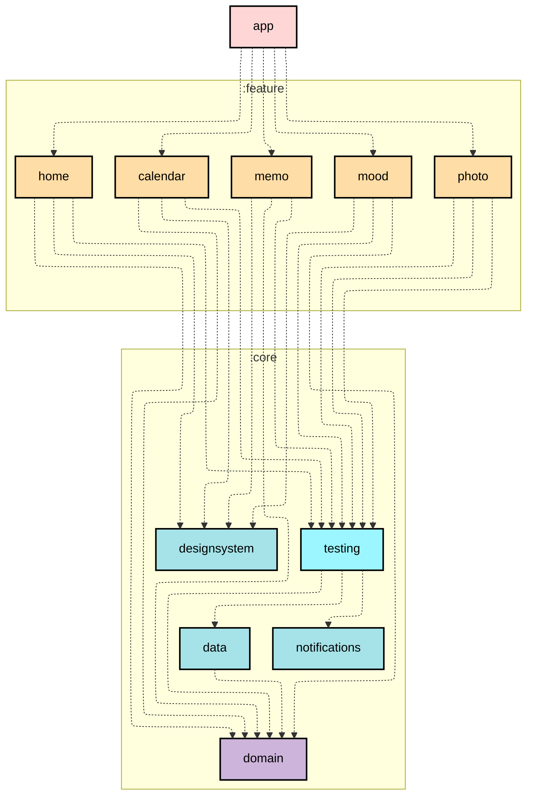

# LifeLog Android App

LifeLog는 Kotlin과 Compose를 기반으로 구현된 안드로이드 앱입니다.
Clean Architecture와 MVVM 패턴을 따르며, 대부분의 모듈은 테스트 코드로 검증된 안정적인 구조를 가지고 있습니다.
소중한 메모를 남기고, 다양한 일기를 기록하며 나만의 비밀 기록 애플리케이션으로 활용할 수 있습니다.

## Module dependency graph

## Modules

- **:app**: 모든 모듈에 접근할 수 있는 최상위 모듈 (여기서는 feature의 내비게이션 담당)
- **:core:data**: 데이터 레이어 모듈, domain 모듈에만 접근 가능한 모듈
- **:core:domain**: 레이어간 독립을 지원하는 모듈, 다른 모듈에 접근 할 수 없는 Kotlin 모듈
- **:core:designsystem**: 컴포넌트와 모든 UI 관련(Icons, Theme, Util)을 담당하는 모듈
- **:core:testing**: feature 모듈용 테스트 헬퍼(TestRepository, Rule, Runner 등) 제공하는 모듈
- **:feature**: 기능 단위로 나눠진 모듈, domain, designsystem, testing에 접근 하는 모듈

## Testing

LifeLog App은 모든 레이어에 대한 테스트를 수행하며, Mock 라이브러리를 사용하지 않고 Hilt Test Api와 수동 주입을 활용합니다.

- **모든 계층**에 대한 테스트 수행:
    - :core:data -> DatabaseTest(Room, Dao 검증)
    - :core:data -> RepositoryTest(TestDao를 이용한 Repository 단위 테스트를 통해 검증)
    - :core:data -> MapperTest(변환 로직 검증)
    - :feature -> 모든 feature 모듈의 각 ViewModel 테스트 완료
        - ViewModel이 의존하는 UseCase 역시 함께 검증됨
        - 따라서 domain 모듈은 따로 테스트를 진행하지 않음
- `Given | When | Then` 방식으로 작성
- 비동기 처리 코드는 TestDispatcher 활용하여 검증
- 가능한 모든 단위 테스트와 통합 테스트를 진행
- State 변화와 데이터 흐름이 의도대로 동작하는지 검증
- 실제 인터페이스를 구현한 간단하지만 의도대로 동작하는 테스트용 Repository, Dao 등을 사용

## 🛠️ Tech Stack

| **분류**            | **내용**                         |
|-------------------|--------------------------------|
| **Language**      | Kotlin                         |
| **Jetpack**       | Compose, Navigation, ViewModel |
| **Architecture**  | Clean Architecture, MVVM       |
| **Asynchronous**  | Coroutine, Flow(cold, hot)     |
| **Database**      | Room                           |
| **Image Loading** | Coil                           |
| **DI**            | Hilt                           |
